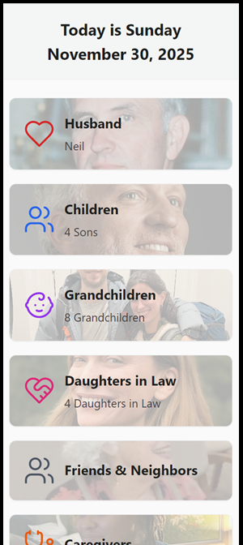

# "Judy's Family" - Memory Aid App (Private Repo)

A mobile-friendly web application designed to help seniors identify and remember family members, friends, and caregivers through photos and simple navigation.

## About This App

This app was created specifically for Mom, an 89-year-old user who wants an easy way to look up and remember the people in her life. The design prioritizes:

- **Extra-large text** that's easy to read
- **Big touch buttons** that are easy to tap
- **High contrast colors** for visibility
- **Simple navigation** with one action per screen
- **Photos with names** for easy recognition

## How to Use the App

### Home Screen

When you open the app, you'll see a search bar, category buttons, and special feature buttons:

- **Search**: Type any name, relationship, or location to find someone
- **Categories**: Tap a category (like "Children" or "Grandchildren") to see everyone in that group
- **Birthdays**: Shows the next 3 upcoming birthdays with photos, names, and countdown to their special day
- **Memory Quiz**: A fun 5-question game to practice remembering family members - see a photo and guess who it is!

### Viewing a Category

After tapping a category, you'll see photo cards for each person. Each card shows:
- Their photo (or initials if no photo)
- Their name
- Their relationship to you

Tap any card to see more details about that person.

### Person Details

The detail page shows everything about a person:
- Large photo with their name and role
- Where they live
- Their birthday and age
- Their spouse (tap the name to see their page)
- Their children (tap any name to see their page)
- A summary about them

Tap the blue **Back** button to return.

### Birthdays

The Birthdays page shows the next 3 upcoming birthdays in your family and friends. Each birthday card displays:
- The person's photo
- Their name and relationship
- How many days until their birthday

This helps you never miss an important celebration!

### Memory Quiz

The Memory Quiz is a fun way to practice remembering everyone:
- You'll see 5 random photos one at a time
- Tap the name you think matches the photo
- Get instant feedback on whether you're right
- See your final score at the end
- Quiz results are tracked over time on the admin page

## Categories

The app organizes people into these groups:

| Category | Description |
|----------|-------------|
| Husband | Neil Smith |
| Children | Your 4 sons |
| Grandchildren | Your 8 grandchildren |
| Daughters in Law | Your sons' wives |
| Friends | Close friends |
| Caregivers | People who help you |
| Other | Other important people |

## Admin Features

The admin page lets you edit information and upload photos. To access it:

1. On the home screen, tap **"Admin view"** at the bottom
2. This opens the admin page in a new window

### Adding a New Person

1. Find the category you want to add someone to
2. Tap the **"+ Add Person"** button for that category
3. Fill in the form with their information
4. Tap **"Add Person"** to save

### Editing Someone's Information

1. Find the person in their category
2. Tap the **pencil icon** next to their name
3. Make your changes in the form
4. Tap **"Save Changes"**

### Uploading a Photo

1. In the edit form, tap **"Upload Photo"**
2. Select a photo from your device
3. Use the cropper to adjust the photo
4. Tap **"Save"** to apply the cropped photo
5. Tap **"Save Changes"** to save all edits

### Photo Tips

- Photos are automatically cropped to a square
- Drag and zoom to position the face in the center
- The preview shows how the photo will look

### Quiz Results Chart

The admin page includes a chart showing Memory Quiz performance over time, so you can track progress.

### Returning to Main App

Tap the **"Home"** button at the top of the admin page to return to the main app view.

## Technical Notes

- The app works on phones, tablets, and computers
- All data is stored in a secure database
- Photos are stored directly in the database
- No login is required (single-user app)

## Version

**Version 1.0** - November 26, 2025

---

*Built with love for Mom*
